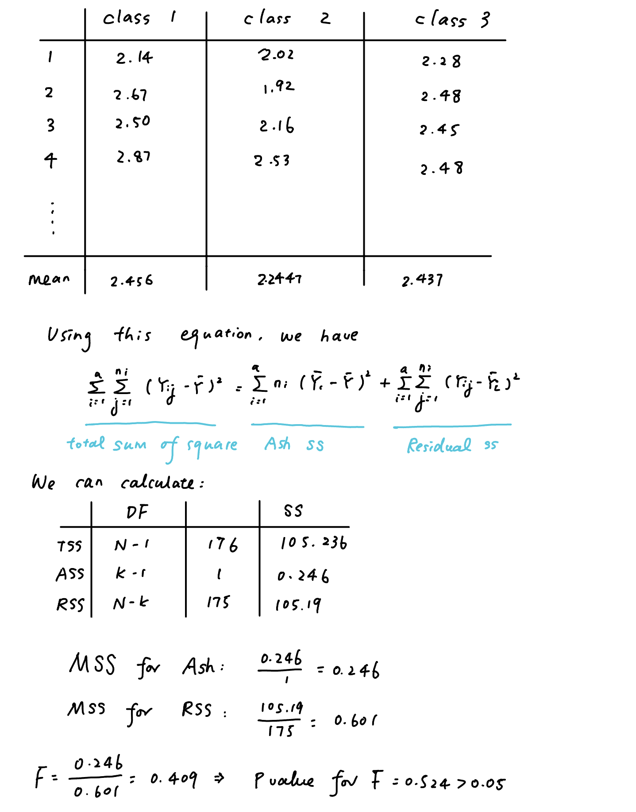

```{r setup, include=FALSE}
knitr::opts_chunk$set(echo = TRUE)
```

```{r}
library(tidyverse)
```

# Problem 1

## a, b

```{r}
wine_data<-read.csv("wine.data")

colnames(wine_data) <- c("class", "Alcohol", "Malicacid", "Ash","Alcalinity of ash", "Magnesium", "Total phenols", "Flavanoids","Nonflavanoid_phenols", "Proanthocyanins", "Color_intensity", "Hue","0D280_0D315_of_diluted_wines", "Proline")

head(wine_data)
```

## c

### 1, 2

```{r}
which.max(wine_data$Alcohol)
```

> As the result gives 8, and we go back to the table, we can find that it is from class 1

```{r}
which.min(wine_data$Alcohol)
```

> As the result gives 115, and we go back to the table, we can find that it is from class 2

```{r}
mean(wine_data$Alcohol)

wine_data_1<-wine_data%>%filter(class=="1")
#mean(wine_data_1$Alcohol)

wine_data_2<-wine_data%>%filter(class=="2")
#mean(wine_data_2$Alcohol)

wine_data_3<-wine_data%>%filter(class=="3")
#mean(wine_data_3$Alcohol)

#wine_data%>%filter(class=="1")%>%filter(Alcohol)%>%mean()
```

#\> From the result we can say that the class 1 has the highest alcohol content, while the class 2 has the lowest alcohol content.

### 3, 4

```{r}
wine_data%>%filter(Magnesium>"114")%>%nrow()
wine_data_1%>%filter(Magnesium>"114")%>%nrow()
wine_data_2%>%filter(Magnesium>"114")%>%nrow()
wine_data_3%>%filter(Magnesium>"114")%>%nrow()
```

> There are 122 wines having higher levels of magnesium than the average level of German beers; there are 30 in class 1, 59 in class 2, and 33 in class 3 having higher levels respectively.

## d

```{r}
mean_0<-wine_data%>%summarise_all(mean)
mean_1<-wine_data_1%>%summarise_all(mean)
mean_2<-wine_data_2%>%summarise_all(mean)
mean_3<-wine_data_3%>%summarise_all(mean)

combined<-rbind(mean_0,mean_1,mean_2,mean_3)
combined
```

## e

```{r}
summary(aov(class~Ash,data=wine_data))

mean(wine_data_1$Ash)
mean(wine_data_2$Ash)
mean(wine_data_3$Ash)
```

> Here from the results we can say that p=0.524\>0.05, so there are no huge differences between those three classes

> To write the process of t-test. We have the null hypothesis as $H_0:\tau_1=\tau_2=...=\tau_k$ and $F=\frac{\sum^k_{i=1}n_i(\bar{y}_{i.}-\bar{y}_{..})^2/(k-1)}{\sum^k_{i=1}\sum^{ni}_{j=1}(y_{ij}-\bar{y}_{i.})^2/(N-k)}$

> I wrote the process down: {width="800"}

```{r}
#lmod <- lm(class~Ash, data=wine_data)
#lmod_sum<-summary(lmod)
```

# Problem 2

## a

```{r}
library(VeryLargeIntegers)
```

```{r}
isPerfect <- function(number, power) {
  if (number < 0 || power <= 1) {
    stop("Invalid input: Number must be non-negative, and power must be greater than 1.")
  }
  root_candidate <- 2
  while (root_candidate ^ power <= number) {
    candidate_power <- root_candidate ^ power
    if (candidate_power == number) {
      return(list(isPerfect = TRUE, root = root_candidate))
    }
    root_candidate <- root_candidate + 1
  }
  
  return(list(isPerfect = FALSE, root = sqrt(number)))
}

isPerfect(16,power=4)
```

## b

```{r}
findRootPower <- function(input) {
  if (input < 0) {
    return("Invalid input: Input must be a non-negative integer.")
  }
  
  for (power in 2:10) {  # You can adjust the range of powers to check
    result <- isPerfect(input, power)
    if (result$isPerfect) {
      return(paste(input, "=", result$root, "^", power, sep = ""))
    }
  }
  
  return("The input is not a perfect power.")
}

findRootPower(64)
findRootPower(27)
findRootPower(13060694016)
findRootPower(7776)
findRootPower(170859375)
findRootPower(58247422)
findRootPower(94143178827)
```

# Problem 3

## a

```{r}
# Function to determine the name of a poker hand
get_poker_hand_name <- function(suits, ranks) {
  is_flush <- length(unique(suits)) == 1
  is_straight <- max(ranks) - min(ranks) == 4 && length(unique(ranks)) == 5
  rank_counts <- table(ranks)
  
  if(is_flush && is_straight&&max(ranks)==14){
    return("Royal Flush")
  }
  else if (is_flush && is_straight) {
    return("Straight Flush")
  } else if (max(rank_counts) == 4) {
    return("Four of a Kind")
  } else if (max(rank_counts) == 3 && sum(rank_counts == 2) == 2) {
    return("Full House")
  } else if (is_flush) {
    return("Flush")
  } else if (is_straight) {
    return("Straight")
  } else if (max(rank_counts) == 3) {
    return("Three of a Kind")
  } else if (sum(rank_counts == 2) == 4) {
    return("Two Pair")
  } else if (sum(rank_counts == 2) == 2) {
    return("One Pair")
  } else {
    return("High Card")
  }
}

# Function to simulate a round of 5-card stud poker
simulate_poker_round <- function(num_players) {
  if (num_players < 2 || num_players > 10) {
    stop("Number of players must be between 2 and 10.")
  }
  
  # Define the suits and ranks
  suits <- c("Hearts", "Diamonds", "Clubs", "Spades")
  ranks <- c(2:14)
  
  # Create a deck of cards
  deck <- expand.grid(Rank = ranks, Suit = suits)
  
  # Shuffle the deck
  deck <- deck[sample(nrow(deck)), ]
  
  # Deal cards to each player
  hands <- vector("list", num_players)
  for (i in 1:num_players) {
    hands[[i]] <- deck[((i - 1) * 5 + 1):(i * 5), ]
  }
  
  # Determine and print the name of each hand
  for (i in 1:num_players) {
    cat("Player", i, "Hand:", "\n")
    hand <- hands[[i]]
    hand_suits <- hand$Suit
    hand_ranks <- hand$Rank
    cat("Cards:", paste(hand_ranks, hand_suits), "\n")
    cat("Hand Name:", get_poker_hand_name(hand_suits, hand_ranks), "\n\n")
  }
}

# Example usage:
simulate_poker_round(8) # Simulate a round with 4 players

```

## b

> This code can not run without modifications. Initially the code for rank was `ranks <- c(2:10, "Jack", "Queen", "King", "Ace")`, but when we tried to calculate the rank number and the configuration of our cards, the system can not calculate factors and the Console says `‘max’ not meaningful for factors`. Thus I changed this line to `ranks <- c(2:14)`.
>
> Moreover, initially it doesn't have the `Royal Flush` option, but realized it should be shown from the link provided in the problem set so I added it.

## c

```{r}
# Function to determine the name of a poker hand
get_poker_hand_name <- function(suits, ranks) { #Here we defined a function 
  is_flush <- length(unique(suits)) == 1 #If all cards are in the same suite then we will define it as flush
  is_straight <- max(ranks) - min(ranks) == 4 &&  length(unique(ranks)) == 5 #If the highest rank mins the lowest rank is 4 and the length of unique(rank) is 5, meaning there are 5 cards one by one, then it's straight
  rank_counts <- table(ranks) #table() performs a tabulation of categorical variable and gives its frequency as output
  
  if(is_flush && is_straight&&max(ranks)==14){
    return("Royal Flush")
  }
  else if (is_flush && is_straight) { #If it is flush and straight, then we will define it as straight flush
    return("Straight Flush")
  } else if (max(rank_counts) == 4) { #Else if the maximum of rank_counts is 4, we define it as Four of a Kind
    return("Four of a Kind")
  } else if (max(rank_counts) == 3 && sum(rank_counts == 2) == 2) { #Else if the maximum of rank_counts is 3 and 2, we define it as Full House
    return("Full House")
  } else if (is_flush) { #If it satisfies is_flush, we will define it as Flush
    return("Flush")
  } else if (is_straight) {#If it satisfies is_flush, we will define it as Straight
    return("Straight")
  } else if (max(rank_counts) == 3) {#Else if the maximum of rank_counts is 3, we define it as Three of a Kind
    return("Three of a Kind")
  } else if (sum(rank_counts == 2) == 4) {#If there four cards in which each two have the same rank_counts, then there are two pairs
    return("Two Pair")
  } else if (sum(rank_counts == 2) == 2) {#If there two cards and they have the same rank_counts, then there are one pair
    return("One Pair")
  } else {#If all above are not satisfied, then we will say it as High Card
    return("High Card")
  }
}

# Function to simulate a round of 5-card stud poker


simulate_poker_round <- function(num_players) { # Here we defined a function
  if (num_players < 2 || num_players >10) { #If number of players are below 2 or above 8, then we will say Number of players must be between 2 and 8.
    stop("Number of players must be between 2 and 10.")#This function stops execution of the current expression, prints the message given as its argument and then returns to the top level prompt
  }
  
  suits <- c("Hearts", "Diamonds", "Clubs", "Spades")
  ranks <- c(2:14) #Here we define the suits and ranks; to avoid the problem of calculating a factor, we use only numbers to define ranks
  
  deck <- expand.grid(Rank = ranks, Suit = suits)  #Here we create a deck of cards
  
  deck <- deck[sample(nrow(deck)), ]#We shuffle the deck with the sample() function
  
  hands <- vector("list", num_players)#We vectorize it
  for (i in 1:num_players) {#We use a for loop here to add cards to hards
    hands[[i]] <- deck[((i - 1) * 5 + 1):(i * 5), ]
  }
  
  for (i in 1:num_players) {#Determine and print the name of each hand
    cat("Player", i, "Hand:", "\n") #Here we use cat() to concatenate together several objects, and \n is to break the line
    hand <- hands[[i]] #[[]] = can extract one element from list or data frame, returned object 
    hand_suits <- hand$Suit#We extract suit from hand
    hand_ranks <- hand$Rank#We extract rank from hand
    cat("Cards:", paste(hand_ranks, hand_suits), "\n")#Here we use cat() to concatenate together several objects. We use the paste() function to take multiple elements from the multiple vectors and concatenates them into a single element
    cat("Hand Name:", get_poker_hand_name(hand_suits, hand_ranks), "\n\n") #We utilize the get_poker_hand_name() function above to cite that function above
  }
}
```

## d

> The inputs and outputs are as described above

> The hands are valid

> All the names of hands are correct

> If it is larger than 10, then the function will stop to execute because there should be no more 10 players as there are only 52 cards in a standard deck
