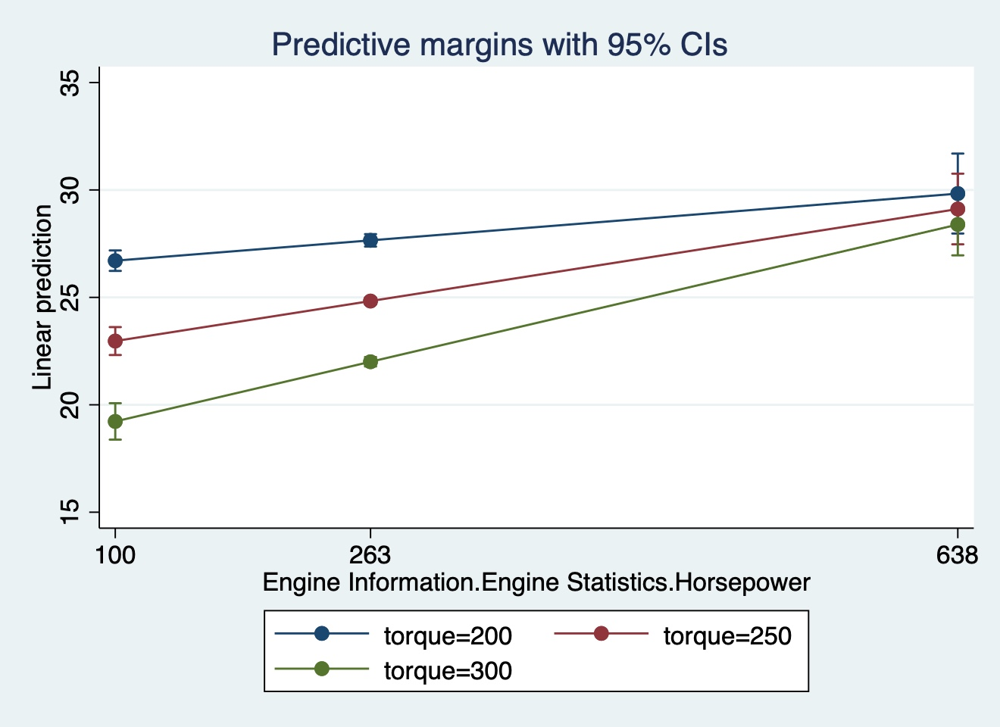

```{r setup, include=FALSE}
knitr::opts_chunk$set(echo = TRUE)
```

```{r}
library(tidyverse)
```

> The Github link for this assignment: <https://github.com/zongyiliu/15_STATS_506/tree/main/Problem_Set_2>

# Problem 1 Dice Game

## a

### version 1

```{r}
play_dice_v1 <- function(number_rolls) {
  cost_per_roll <- 2
  winnings <- 0
  for (i in 1:number_rolls) {# use the for loop here 
    roll <- sample(1:6, 1, replace = TRUE) # get a randomization of 1 to 6 (all sizes of dices)
    if (roll %% 2 == 0) { # if it is evenly divided, then
      winnings <- winnings + roll- cost_per_roll #then the profit we get is roll minus the cost to play
    } else {
      winnings <- winnings - cost_per_roll # if else, then the profit would be negative, which is $2
    }
  }
  return(winnings)
}
```

### version 2

```{r}
play_dice_v2 <- function(number_rolls) {
  cost_per_roll <- 2
  rolls <- sample(1:6, number_rolls, replace = TRUE)
  winnings_per_roll <- ifelse(rolls %% 2 == 0, rolls-cost_per_roll, -cost_per_roll) #here I use the ifelse() to show cases whether it's evenly divided or not
  winnings <- sum(winnings_per_roll) # the built-in function is sum(), which can vectorize and calculate the sum of winnings per roll
  return(winnings) #return the result
}
```

### version 3

```{r}
play_dice_v3 <- function(number_rolls) {
  winnings=0
  number<-1:6
  rolls <- sample(1:6, number_rolls, replace = TRUE)
  table_num<-table(rolls) #use the table to create a table containg frequency and the number on dices
  missing_values<-number[!(1:6%in%names(table_num))] #delete missing values if some numbers are not appearing
  table_num[as.character(missing_values)]<-0
  winnings=-2*sum(table_num[names(table_num)==1])-2*sum(table_num[names(table_num)==3])-2*sum(table_num[names(table_num)==5])+0*sum(table_num[names(table_num)==2])+2*sum(table_num[names(table_num)==4])+4*sum(table_num[names(table_num)==6]) # calculate the total profits with table()
  return(winnings)
}
```

### version 4

```{r}
play_dice_v4 <- function(num_rolls) {
  cost_per_roll <- 2
  rolls <- sample(1:6, num_rolls, replace = TRUE) #similar steps as before
  calculate_winnings <- function(roll) {
    if (roll %% 2 == 0) {
      return(roll-cost_per_roll)
    } else {
      return(-cost_per_roll)
    }
  }
  total_winnings <- sum(sapply(rolls, calculate_winnings)) #use apply() function and repeate the calculate_winnings function to rolls
  return(total_winnings)
}
```

## b

```{r}
play_dice_v1(3)
play_dice_v2(3)
play_dice_v3(3)
play_dice_v4(3)

play_dice_v1(3000)
play_dice_v2(3000)
play_dice_v3(3000)
play_dice_v4(3000)
```

## c

```{r}
set.seed(1)
play_dice_v1(3)
set.seed(1)
play_dice_v2(3)
set.seed(1)
play_dice_v3(3)
set.seed(1)
play_dice_v4(3)

# set.seed() can solve this problem. After adding set.seed(), four versions can give the same outcome

set.seed(1)
play_dice_v1(3000)
set.seed(1)
play_dice_v2(3000)
set.seed(1)
play_dice_v3(3000)
set.seed(1)
play_dice_v4(3000)
```

## d

```{r}
library(microbenchmark)
```

```{r}
num_rolls<-100
mb_1<-microbenchmark(play_dice_v1(num_rolls),
                     play_dice_v2(num_rolls),
                     play_dice_v3(num_rolls),
                     play_dice_v4(num_rolls))

mb_1
```

> The best parameter to investigate the mean and median time to execute. After seeing those numbers, we can say the play_dice_v2() performs the best.

```{r}
num_rolls<-10000
mb_2<-microbenchmark(play_dice_v1(num_rolls),
                     play_dice_v2(num_rolls),
                     play_dice_v3(num_rolls),
                     play_dice_v4(num_rolls))
mb_2
```

> We can get the same results for large input. Version 2 plays the best.

## e

```{r}
reps <- 400
n1 <- vector(length = reps)
for (i in seq_len(reps)) {
  n1[i] <- play_dice_v1(100)
}
n2 <- vector(length = reps)
for (i in seq_len(reps)) {
  n2[i] <- play_dice_v2(100)
}
n3 <- vector(length = reps)
for (i in seq_len(reps)) {
  n3[i] <- play_dice_v3(100)
}
n4 <- vector(length = reps)
for (i in seq_len(reps)) {
  n4[i] <- play_dice_v4(100)
}

boxplot(data.frame(n1, n2, n3, n4))
abline(col = "red")
```

> It's fair, since from the bar plot, we can see that all values are centered around 0 (the median and mean are near 0).

# Problem 2 Linear Regression

## a

> Rename the columns of data to more reasonable lengths as below:

```{r}
the_table<-read.csv("cars.csv")

the_table_2<-the_table%>%
  rename("Height"="Dimensions.Height",
         "Length"="Dimensions.Length",
         "Width"="Dimensions.Width",
         "Driveline"="Engine.Information.Driveline",
         "Engine_Type"="Engine.Information.Engine.Type",
         "Hybrid"="Engine.Information.Hybrid",
         "Number_of_Forward_Gears"="Engine.Information.Number.of.Forward.Gears",
         "Transmission"="Engine.Information.Transmission",
         "City_mpg"="Fuel.Information.City.mpg",
         "Fuel_Type"="Fuel.Information.Fuel.Type",
         "Highway_mpg"="Fuel.Information.Highway.mpg",
         "Classification"="Identification.Classification",
         "ID"="Identification.ID",
         "Make"="Identification.Make",
         "Model_Year"="Identification.Model.Year",
         "Year"="Identification.Year",
         "Torque"="Engine.Information.Engine.Statistics.Torque",
         "Horsepower"="Engine.Information.Engine.Statistics.Horsepower"
         )

head(the_table_2)
```

## b

> Restrict the data to cars whose Fuel Type is "Gasoline".

```{r}
the_table_3<-the_table_2%>%filter(Fuel_Type=="Gasoline")
head(the_table_3)
```

## c

```{r}
lmod<-lm(Highway_mpg~Horsepower+Height+Length+Width+Torque+as.factor(Year), data=the_table_3)

summary(lmod)
```

> The estimate coefficients for `Horsepower` is 0.016536, meaning that the `Horsepower` and `Highway_mpg` have a positive relationship, `Highway_mpg` would increase as `Horsepower` increases, but the number is quite small. Also, for the p-value of `Horsepower`, it is smaller than 0.05, meaning that it is statistically significant, so we can keep this parameter in the model.

## d

```{r}
cor(the_table_3$Horsepower, the_table_3$Torque)
```

> The `cor()` helps to confirm that there is a correlation between the `Horsepower` and `Torque` variables.

```{r}
library(emmeans)
```

```{r}
summary(the_table_3$Horsepower)
```

> I chose the minimum, maximum, and mean as three values for horsepower, as did in class


```{r}
lmod_6<-lm(Highway_mpg ~ Horsepower*Torque+Height+Length+Width+as.factor(Year), data =the_table_3)
summary(lmod_6)
emmip(lmod_6, Torque~Horsepower,at = list(Horsepower = c(100, 263, 638), Torque=c(200,250,300)))
```

## e

```{r}
beta<-lmod$coefficients

y<-the_table_3$Highway_mpg
X<-cbind(1, the_table_3$Horsepower, the_table_3$Torque, the_table_3$Horsepower*the_table_3$Torque)

# Using OLS formula to calculate beta
# It works on computers in school, but the R in my laptop can not run t() function, but this code is correct

beta_coef <-solve(t(X) %*% X) %*% t(X) %*% y


beta
beta_coef
```

> Results are the same as calculated before

# Problem 3 Stata

## a

> Import the csv, and rename all variables

``` stata
 import delimited cars
(encoding automatically selected: ISO-8859-1)
(18 vars, 5,076 obs)

. rename dimensionsheight height

. rename dimensionslength length

. rename dimensionswidth width

. rename v18 torque

. rename engineinformationtransmission transmission

. rename engineinformationdriveline driveline

. rename engineinformationenginestatistic horsepower

. rename fuelinformationhighwaympg highwaympg

. rename engineinformationenginetype enginetype

. rename engineinformationhybrid hybrid

. rename engineinformationnumberofforward numberofforward 

. rename fuelinformationcitympg citympg

. rename fuelinformationfueltype fueltype

. rename identificationclassification classification

. rename identificationmodelyear modelyea

. rename modelyea modelyear

. rename identificationmake make

. rename identificationid ID

. rename identificationyear IDyear
```

## b

> Restrict all Fuel type tp be "Gasoline" by setting `if fueltype=="Gasoline"` as below.

## c

> Fit a linear regression model. The results are the same as in Problem 2(c)

``` stata
reg highwaympg horsepower length width height torque i.IDyear if fueltype=="Gasoline"

      Source |       SS           df       MS      Number of obs   =     4,591
-------------+----------------------------------   F(8, 4582)      =    413.35
       Model |  70043.6695         8  8755.45869   Prob > F        =    0.0000
    Residual |   97055.298     4,582  21.1818634   R-squared       =    0.4192
-------------+----------------------------------   Adj R-squared   =    0.4182
       Total |  167098.968     4,590  36.4050038   Root MSE        =    4.6024

------------------------------------------------------------------------------
  highwaympg | Coefficient  Std. err.      t    P>|t|     [95% conf. interval]
-------------+----------------------------------------------------------------
  horsepower |   .0163556   .0022772     7.18   0.000     .0118913      .02082
      length |    .001729   .0008836     1.96   0.050    -3.36e-06    .0034613
       width |  -.0003343   .0009045    -0.37   0.712    -.0021075    .0014388
      height |   .0099079   .0011267     8.79   0.000      .007699    .0121168
      torque |  -.0507425    .002203   -23.03   0.000    -.0550614   -.0464236
             |
      IDyear |
       2010  |  -.4539681   .6768246    -0.67   0.502     -1.78087    .8729342
       2011  |   .1711016   .6757043     0.25   0.800    -1.153604    1.495808
       2012  |   1.302928   .6810076     1.91   0.056    -.0321751    2.638031
             |
       _cons |   32.29266   .7225982    44.69   0.000     30.87602     33.7093
------------------------------------------------------------------------------
```

## d

> Fit the regression again with interaction terms of torque and horsepower.

``` stata
reg highwaympg torque horsepower c.horsepower#c.torque length width height i.IDyear if fueltype=="Gasoline"

      Source |       SS           df       MS      Number of obs   =     4,591
-------------+----------------------------------   F(9, 4581)      =    480.07
       Model |  81105.8715         9  9011.76351   Prob > F        =    0.0000
    Residual |   85993.096     4,581  18.7716865   R-squared       =    0.4854
-------------+----------------------------------   Adj R-squared   =    0.4844
       Total |  167098.968     4,590  36.4050038   Root MSE        =    4.3326

---------------------------------------------------------------------------------------
           highwaympg | Coefficient  Std. err.      t    P>|t|     [95% conf. interval]
----------------------+----------------------------------------------------------------
               torque |  -.0860593   .0025333   -33.97   0.000    -.0910257   -.0810928
           horsepower |  -.0166633   .0025388    -6.56   0.000    -.0216406    -.011686
                      |
c.horsepower#c.torque |   .0001124   4.63e-06    24.28   0.000     .0001033    .0001214
                      |
               length |   .0017767   .0008318     2.14   0.033     .0001459    .0034075
                width |  -.0011694   .0008521    -1.37   0.170      -.00284    .0005011
               height |   .0065604   .0010696     6.13   0.000     .0044634    .0086573
                      |
               IDyear |
                2010  |  -.5627858   .6371716    -0.88   0.377    -1.811949    .6863777
                2011  |   .0725356   .6361142     0.11   0.909    -1.174555    1.319626
                2012  |   1.197033   .6411085     1.87   0.062    -.0598488    2.453915
                      |
                _cons |   42.18795   .7930274    53.20   0.000     40.63323    43.74266
---------------------------------------------------------------------------------------
```

> The interaction plot is shown below



## e
```stata
    mkmat 1 torque horsepower horsepower*torque, matrix(X)

    mkmat highwaympg, matrix(y)

    X'*X*X'*y
```

> We can get the same result as in 2(e)
